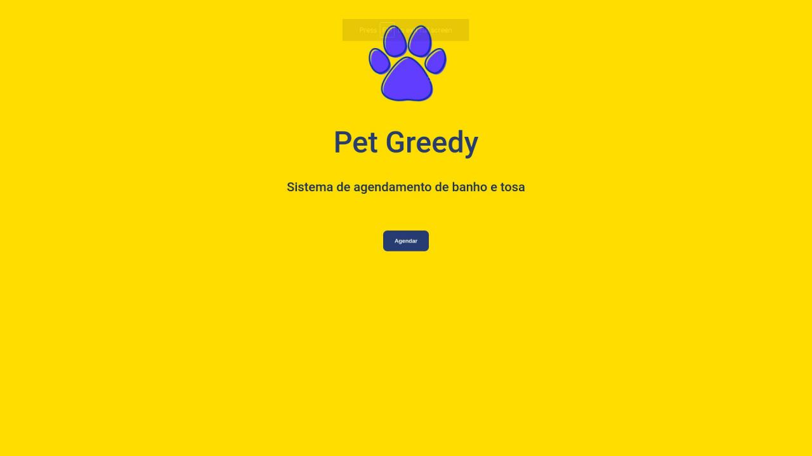
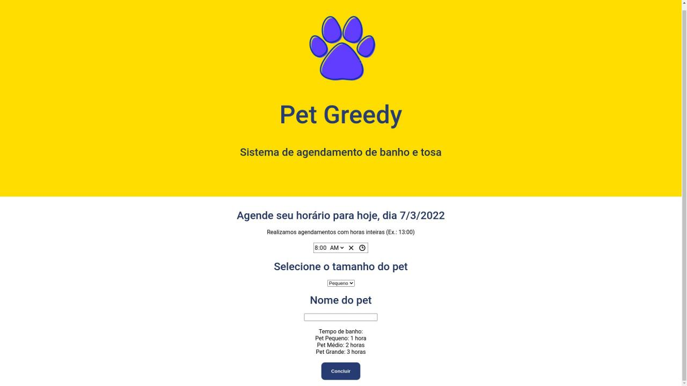
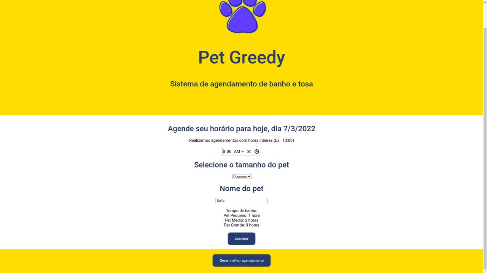
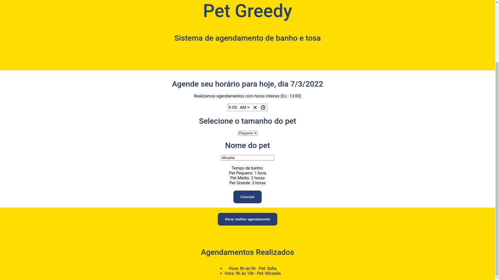

# Pet Greedy

Número da Lista: 3<br>
Conteúdo da Disciplina: Greedy<br>

## Alunos
|Matrícula | Aluno |
| -- | -- |
| 17/0111288  |  Micaella Gouveia |
| 17/0114333  |  Sofia Patrocínio |

## Sobre
O projeto tem como objetivo a implementação do algoritmo Interval Scheduling. Para isso, fizemos uma aplicação que simula o agendamento prévio de banhos para pets. O usuário agenda um horário desejado e o porte do seu animal, após receber todos os pedidos, é gerado então a melhor agenda para aquele dia.

## Screenshots





## Instalação 
Linguagem: Javascript<br>
Framework: ReactJS<br>

Pré-requisitos:
* NodeJS
* ReactJS
* Yarn

## Uso 
É necessário instalar suas dependências usando o comando

```
yarn install
```

Para rodar o projeto
```
yarn start
```

O projeto estará rodando na porta localhost:3000

## Vídeo
[Link Youtube](https://youtu.be/ZKvNK15m0jk)<br>
[Link Drive - baixar](https://drive.google.com/file/d/1zke6AXWvMUC6pWZ-_CpnawV5NwEOn-wS/view?usp=sharing)
